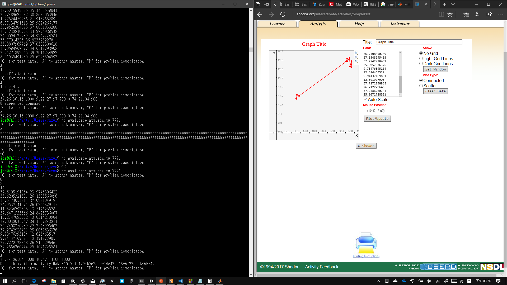
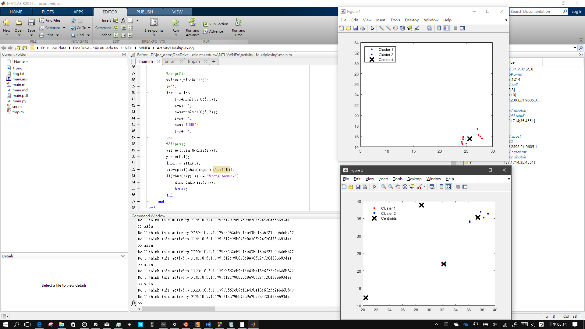

# Wireless Networking - Fundamentals and Applications Activity \#1
## Multiplexing & Multiplexing-p3
* flag
    ```
    Do U think this activity HARD:10.5.1.179:b562cb9c1de43be18c6f23c9ebd6b547
    Do U think this activity FUN:10.5.1.179:812c79b073c9e705b24f20dd8bb93dae
    ```
* 作法1  
    
* 作法2  
    
    * 使用 ```k-means```，然後 Tx power 固定設成 1000mW，當發現 Wrong Answer 的時候就重新試一次 
    ```
    for port = 7771:7772
        while(1)
            t = tcpclient('mvnl.csie.ntu.edu.tw', port);
            while(t.BytesAvailable==0)end
            A = read(t);
            %disp(char(A));
            write(t,[uint8('Q'),10]);
            while(t.BytesAvailable==0)end
            pause(0.1);
            input = read(t);
            ary=split(char(input),char(10));
            n=sscanf(char(ary(1)),'%d');
            %disp(n);
            m=sscanf(char(ary(2)),'%d');
            %disp(m);
            X = [];
            for i = 1:m
                li=sscanf(char(ary(2+i)),'%f %f');
                Y = [li(1),li(2)];
                X = [X;Y];
            end
            %disp(X);
            %disp(n);

            opts = statset('Display','final');
            [idx,C] = kmeans(X,n);

            figure;
            plot(X(idx==1,1),X(idx==1,2),'r.','MarkerSize',12)
            hold on
            plot(X(idx==2,1),X(idx==2,2),'b.','MarkerSize',12)
            plot(C(:,1),C(:,2),'kx',...
                'MarkerSize',15,'LineWidth',3)
            legend('Cluster 1','Cluster 2','Centroids',...
                'Location','NW')

            %disp(C);
            write(t,uint8('A'));
            s="";
            for i = 1:n
                s=s+num2str(C(i,1));
                s=s+" ";
                s=s+num2str(C(i,2));
                s=s+" ";
                s=s+"1000";
                s=s+" ";
            end
            %disp(s);
            write(t,uint8(char(s)));
            pause(0.1);
            input = read(t);
            ary=split(char(input),char(10));
            if(char(ary(1)) ~= "Wrong Answer")
                disp(char(ary(1)));
                break;
            end
        end
    end
    ```
    

